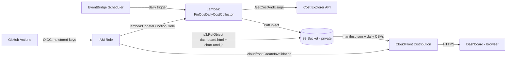

# FinOps Cost Ledger

A serverless AWS billing dashboard that turns raw Cost Explorer data into something a **non-technical stakeholder** can actually read — no console login, no jargon, just a clear daily view of what's being spent and where.

**Live demo:** `https://finops-ledger.nerdyll.site/` 

---

## Why this exists

AWS Cost Explorer is powerful, but it's built for engineers. Most people who need to understand cloud spend — founders, managers, clients — never open it. This project pulls the same underlying data and presents it as a lightweight, self-updating dashboard: a daily spend trend, a "spend calendar" heatmap, a service-by-service breakdown, and plain-language takeaways generated from the numbers themselves.

It was built as a portfolio project to demonstrate a complete, production-shaped serverless pipeline — not just a script, but a system with monitoring, automation, and a real deployment story.

---

## Architecture



**Data flow:**
1. **EventBridge Scheduler** invokes the Lambda function once every 24 hours.
2. **Lambda** calls the Cost Explorer API for the previous day's cost, grouped by service, and writes it as a CSV to S3 (`raw/YYYY-MM-DD.csv`), updating a `manifest.json` index alongside it.
3. **CloudFront** serves the dashboard and data over HTTPS, reaching into the S3 bucket via an **Origin Access Control (OAC)** — the bucket itself is never public.
4. The **dashboard** (a single static HTML file, Chart.js self-hosted) fetches the manifest, pulls each day's CSV client-side, and renders everything in the browser. No backend, no database.
5. **GitHub Actions** deploys changes to the dashboard, Lambda code, and static assets on every push to `main`, authenticating to AWS via **OIDC** — no long-lived access keys stored anywhere.

---

## Tech stack

| Layer | Service | Why |
|---|---|---|
| Scheduling | EventBridge Scheduler | Managed cron, no server to maintain |
| Compute | AWS Lambda (Python 3.14) | Runs for ~2 seconds/day; comfortably free-tier |
| Data source | Cost Explorer API | Authoritative source for AWS billing data |
| Storage | S3 | Cheap, durable, versioned CSV + JSON storage |
| Delivery | CloudFront + OAC | HTTPS, caching, and a private origin bucket |
| Frontend | Static HTML/CSS/JS, Chart.js (self-hosted) | No framework, no build step, no third-party CDN dependency at runtime |
| CI/CD | GitHub Actions + OIDC | Deploys on push, with zero stored AWS credentials |

---

## Security decisions (and why)

This project was built with least-privilege access as a first-class requirement, not an afterthought:

- **No public S3 bucket.** The bucket is fully private; CloudFront reaches it through an Origin Access Control, so the only path in is through CloudFront's edge.
- **Scoped IAM everywhere.** The Lambda role can only call `ce:GetCostAndUsage` and write to its own bucket — nothing else. The GitHub Actions role can only update `dashboard.html`, `chart.umd.js`, invalidate one specific CloudFront distribution, and update one specific Lambda function's code. No wildcard permissions.
- **OIDC instead of access keys.** GitHub Actions authenticates to AWS using short-lived tokens exchanged for a temporary session — there is no `AWS_ACCESS_KEY_ID` or `AWS_SECRET_ACCESS_KEY` stored in this repository, in GitHub Secrets, or anywhere else. The trust policy is scoped to this exact repository and branch, so a fork cannot assume the deployment role.
- **Self-hosted dependencies.** Chart.js is bundled into the deployment rather than pulled from a third-party CDN at page-load time, removing a runtime dependency on an external domain staying reachable and avoiding Subresource Integrity/ad-blocker conflicts.
- **Root account used exactly once.** Enabling Cost Explorer requires a root-level action; every other permission in this project was granted through IAM roles and policies, following the principle that root should be touched as rarely as possible.

---

## Project structure

```
finops-cost-ledger/
├── dashboard/
│   ├── dashboard.html      # the dashboard itself
│   └── chart.umd.js        # self-hosted Chart.js 4.4.1
├── lambda/
│   └── lambda_function.py  # cost collector + manifest writer
├── .github/
│   └── workflows/
│       └── deploy.yml      # CI/CD: S3 sync, CloudFront invalidation, Lambda update
└── README.md
```

---

## How the dashboard reads data

Rather than granting the bucket public `ListBucket` (which would expose the entire folder structure to anyone), Lambda maintains a small `raw/manifest.json` file listing which dates have data. The dashboard fetches that manifest first, then requests only the CSVs it lists — a small but deliberate choice to avoid leaking more than necessary about the bucket's contents.

---

## Deploying your own copy

1. **AWS setup** — enable Cost Explorer, create a private S3 bucket (versioning + default encryption on), and create the Lambda function with a least-privilege IAM role (`ce:GetCostAndUsage`, `s3:PutObject` scoped to the bucket, CloudWatch Logs).
2. **CloudFront** — create a distribution pointing at the bucket via Origin Access Control, with `dashboard.html` as the default root object.
3. **EventBridge Scheduler** — create a 1-day rate schedule targeting the Lambda function.
4. **GitHub OIDC** — add `token.actions.githubusercontent.com` as an IAM identity provider, and create a role trusted only by this repo/branch with permissions scoped to your bucket, distribution, and function ARNs.
5. **Push to `main`** — GitHub Actions handles the rest.

---

## What's next

- Custom subdomain via ACM + Route 53
- SNS-based budget threshold alerts
- Cost anomaly detection using Cost Explorer's built-in anomaly monitor

---

## License

MIT — use, fork, and adapt freely.
